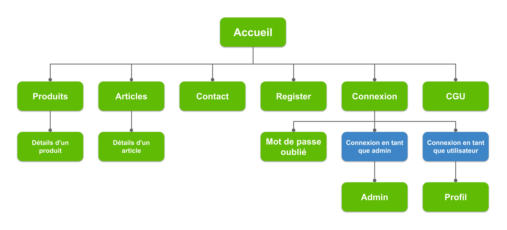

# Moricet-Massage

Ce projet a été réalisé dans le cadre de notre deuxième année de formation en développement et conception d'applications.

**Les consignes du projet sont les suivantes :**

- Vous êtes une entreprise
dans le secteur de votre
choix (choisissez un sujet
qui vous intéresse).
- Vous créez du contenu
régulièrement sur YouTube,
Facebook et Instagram.
- Vous avez pour objectif de
faire connaître votre site
Web par le biais de ces
réseaux sociaux.

**Les objectifs à remplir :**

- Créer un site Web
présentant votre projet.
- Présenter les réseaux
sociaux sur lesquels vous
êtes.
- Mettre en oeuvre un
système de page de
contact avec email de
confirmation.
- Proposer un plan de site.

---

## Plan du site



---

## Contributeurs

Les **membres constituant le groupe** sont les suivants :

- [Alexandre Garault](https://github.com/Dreeion)
- [Axelle Guinaudeau](https://github.com/Theia01)
- [Camille Naulet](https://github.com/camillenaulet03)
- [Johan Deleon](https://github.com/Amestyale)
- [Maël Debon](https://github.com/maeldebon)

---

## Utiliser l'application en local


### Dépendances requises :

Avant toute chose, certaines installations sont **requises** pour pouvoir utiliser ce projet :

- [PHP](https://www.php.net/downloads.php) (version 7 ou supérieure),
- Un serveur local ([WAMP](http://www.wampserver.com/en/), [XAMPP](https://www.apachefriends.org/download.html) ou autre),
- [Composer](https://getcomposer.org/download/).

### Mettre en place le projet

Il vous faut ensuite **cloner le projet :**
```sh
git clone git@github.com:Theia01/Moricet-Massage.git
```

Une fois cela fait, rentrez dans le fichier créé et exécutez les commandes suivantes :
```sh
composer install
npm install
```

Lorsque les installations sont terminées, vous pouvez copier le fichier `.env.example` et le renommer en `.env`.
Pour **générer la clé ssh**, la commande est celle-ci :
```sh
php artisan key:generate
```

Enfin, **lancez l'application** en utilisant la commande :
```sh
php artisan serve
```

### Compiler le SCSS en CSS

Si vous souhaitez **compiler le CSS** à chaque changement, tapez cette commande dans un autre terminal :
```sh
npm run watch
```

Pour compiler une seule fois, entrez cette commande :
```sh
npm run dev
```

### Connexion à la base de données

La connexion à la base de données est **requise** pour afficher les informations disponibles sur la page de présentation des produits.
Cette commande permet d'installer `kreait/laravel-firebase` :
````sh
composer require kreait/laravel-firebase
````

Ensuite, il vous faut télécharger le fichier `cacert.pem`, disponible [à cette adresse](https://curl.haxx.se/ca/cacert.pem).
Puis déplacez-vous dans le dossier relatif à votre serveur local, puis dans "bin/php/". Entrez ensuite dans le dossier correspondant à votre version de PHP. Placez le fichier téléchargé ici.
Enfin, il vous suffit de modifier le fichier `php.ini` et de rajouter le lien vers le fichier précédemment rajouté à `curl.cainfo =`. N'oubliez pas de dé-commenter la ligne.
Puis relancez votre invite de commande et votre serveur.
